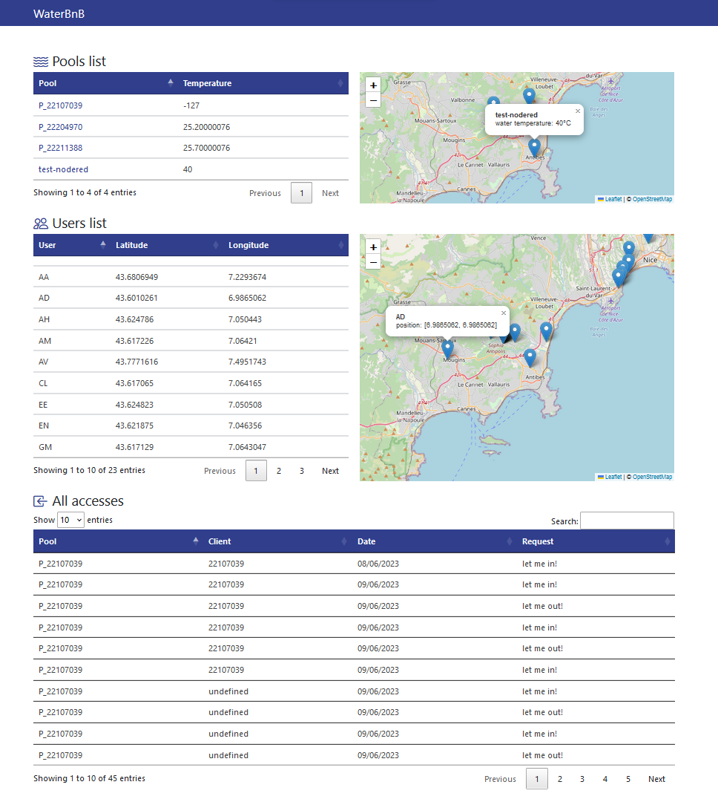
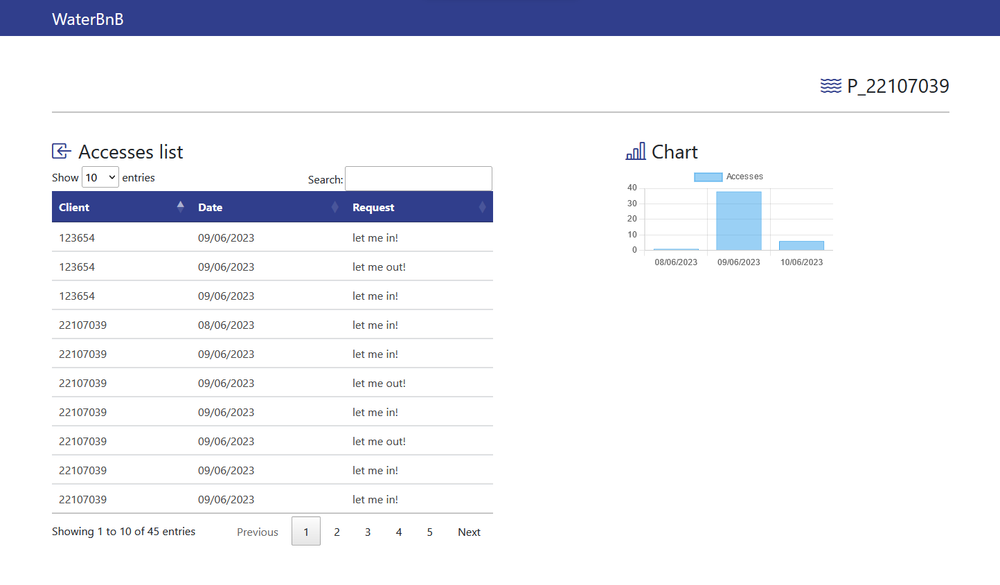

# M1_serviceJS_IOT
 Web Service pour le projet final d'IOT M1 2022-2023

 Code Arduino : https://github.com/Arman-HKB/M1_waterbnb_IOT
 
 Auteurs: Hakobyan Arman
 
 Le service est déployé sur render à l'adresse : https://servicejs-guo-hakobyan.onrender.com/
 (il faut le démarrer manuellement avant de pouvoir l'utiliser).

 Le service gère l'insertion de données dans une base de données Mongo Atlas.
 Un dashboard en EJS et MVC a été ajouté.

 Captures d'écran :
 
 
